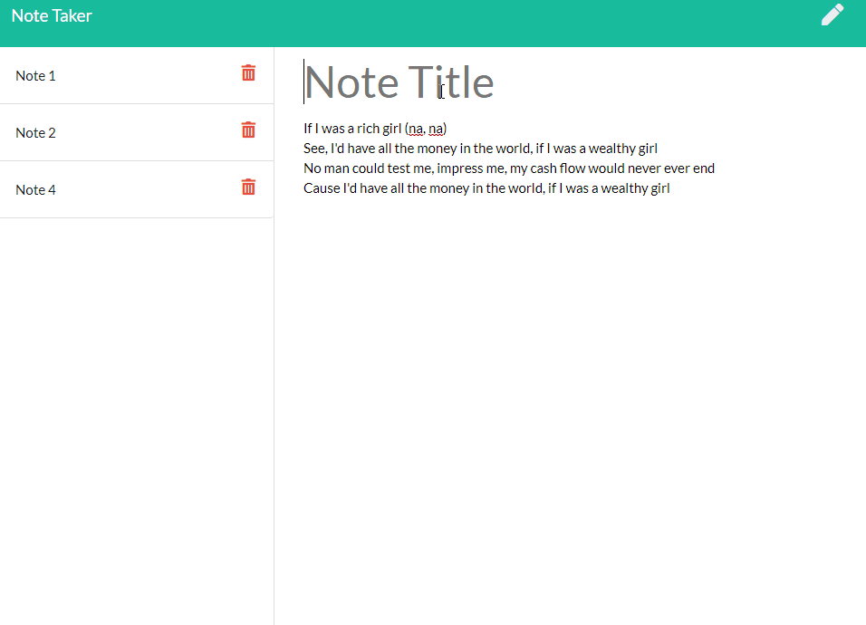

# Note Taking Web App

This application is a simple note taking app that allows a user to write and save notes.

## Objective

- Create a web application using an express server
- Write API routes to access a json database
- Users can save and delete notes

[Note Taking Web App](https://github.com/Diegopie/Team-Profile-Generator/) is hosted on GitHub.

## Outcome

This app was a way to practice creating express servers and hosting with Heroku. I struggled with writing the API routes at first but Postman certainly makes that easier to handle and I've been able to wrap my head around it.

## Future Development

The current version is not robust, as it was just practice with Express and API routes. First, I would like to refactor this app to work as a PWA. Part of that would include connecting this app with a Sequel database. Then I can research working with Passport.js to create user accounts.  

## Collaborators

This application relies on Bootstrap, jQuery, and Expressg

This application was authored by [Diego Hernandez](https://github.com/Diegopie)# bday-cards
